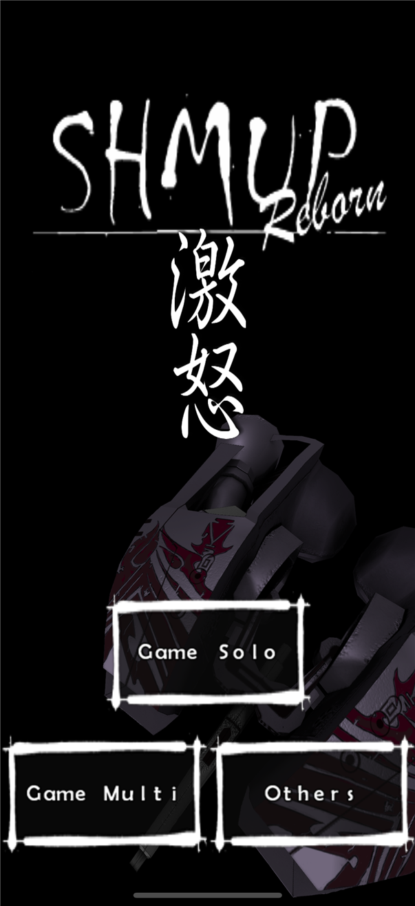

SHMUP
=====

This is the source code of "SHMUP" a 3D Shoot 'em up that I wrote in 2009.  It
is very inspired of Treasure Ikaruga, the engine runs on iOS, Android, Windows
and MacOS X.  It has also been ported to Linux by "xevz".

The main project page is at [http://fabiensanglard.net/shmup/](http://fabiensanglard.net/shmup/)

Technical side
==============

It is written in ANSI C with wrapper for the specific platforms, rendition is
done with OpenGL ES 1.1 and there is even an experimental rendition path based
on OpenGL ES 2.0 that uses the dEngine source ( which can be found here:
[http://fabiensanglard.net/dEngineSourceCodeRelease/index.php](http://fabiensanglard.net/dEngineSourceCodeRelease/index.php)).

Repository layout
=================

    src/core/          the engine and the game, ANSI C, platform-neutral
    src/backends/      what a platform plugs in: apple/ (Metal renderer,
                       AVFoundation sound and music), gl/ (desktop OpenGL
                       renderer), win/ (waveOut effects, MCI music, WIC
                       PNG, settings), android/ (EGL display, assets,
                       OpenSL), posix/ (stdio filesystem), openal/
    src/third_party/   libpng
    ios/               the Xcode project, app delegate, view, plist, icons
    win/               the Windows port (round 87): win/build.ps1 -> ShmupReborn.exe
                       with zig cc alone; the 2010 Visual Studio project sits
                       beside it as it was
    mac/ linux/        the 2010 ports, kept as they were (not built by CI)
    android/           the Gradle project (android/old: the 2010 one)
    data/              every level, model, texture, sound and music
    tools/             the harnesses and generators the CI runs
    store/             the App Store listing, versioned
    .github/workflows  compile check, smokes, TestFlight, App Store Connect

Enjoy

Copyright (C) 2009 Fabien Sanglard
